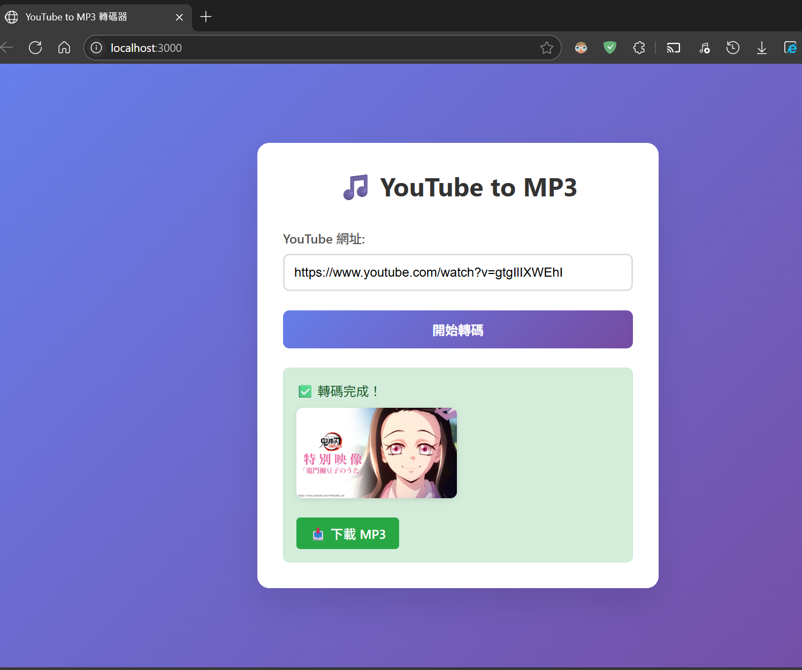

# YT-MP3 Service

🎵 High-performance YouTube to MP3 conversion service built with Rust and Axum



## Key Features

### 🚀 Core Functionality
- **Fast Conversion**: High-performance YouTube to MP3 conversion using yt-dlp and FFmpeg
- **Thumbnail Support**: Automatically download and display video thumbnails
- **Multi-format Support**: Support for MP3, M4A and other audio formats
- **Batch Download**: Support for playlist batch conversion

### 🌐 Web Interface
- **Intuitive Operation**: Clean and easy-to-use web interface
- **Real-time Progress**: Real-time display of conversion progress and status
- **Download Management**: Direct download of audio files after completion

### 🔒 Security & Performance
- **HTTPS Support**: Built-in TLS support with automatic SSL certificate generation
- **Local Operation**: Runs completely locally to protect privacy
- **Self-contained**: Includes all dependencies, no additional installation required

## Installation Methods

### Method 1: Build from Source (Recommended)

#### Environment Requirements
- **Windows 10/11** (64-bit)
- **Rust Toolchain** (latest stable version)
- **Internet Connection** (for downloading dependency tools)

#### Installation Steps

1. **Install Rust**
   ```cmd
   # Download and run Rust installer
   # Visit https://rustup.rs/ to download rustup-init.exe
   rustup-init.exe
   
   # Reopen Command Prompt to verify installation
   cargo --version
   rustc --version
   ```

2. **Download Project**
   ```cmd
   git clone <repository-url>
   cd yt-mp3-service
   ```

3. **Build Project**
   ```cmd
   # Build requires git and bash shell, please install Windows Git first and add it to PATH
   # Download Git installer: https://github.com/git-for-windows/git/releases/download/v2.50.1.windows.1/Git-2.50.1-64-bit.exe

   # Use build script (recommended)
   build.bat
   
   # Or manual build
   cargo build --release
   ```

4. **Verify Installation**
   ```cmd
   # Check generated files
   dir bin\
   # Should see: yt-mp3.exe, cert-gen.exe
   ```

### Method 2: Pre-compiled Version

1. **Download Release Package**
   - Download the latest Windows version from the Releases page
   - Filename: `yt-mp3-service-windows-x64.zip`

2. **Extract**
   ```cmd
   # Extract to any directory
   # Example: C:\yt-mp3-service\
   ```

3. **Run Initialization**
   ```cmd
   cd C:\yt-mp3-service
   install.bat
   ```

## Starting Service

### Quick Start

```cmd
# Method 1: Use service management script (recommended)
scripts\start.bat

# Method 2: Direct execution
bin\yt-mp3.exe
```

### Complete Service Management

```cmd
# Start service
scripts\start.bat

# Check service status
scripts\status.bat

# Stop service
scripts\stop.bat
```

### Service Verification

After startup, visit in browser:
- **HTTP**: http://127.0.0.1:3000
- **HTTPS**: https://127.0.0.1:3443

## Stopping Service

### Normal Stop

```cmd
# Use stop script (recommended)
scripts\stop.bat

# View stop status
scripts\status.bat
```

### Force Stop

```cmd
# If normal stop fails, use force stop
taskkill /F /IM yt-mp3.exe

# Clean up remaining processes
tasklist | findstr server
```

## Usage

### Web Interface Operation

1. **Open Browser** and visit http://127.0.0.1:3000

2. **Paste YouTube URL**
   - Support single video: `https://www.youtube.com/watch?v=VIDEO_ID`
   - Support playlist: `https://www.youtube.com/playlist?list=PLAYLIST_ID`

3. **Start Conversion**
   - Click "Start Transcoding" button
   - Wait for conversion to complete

4. **Download File**
   - Download link automatically displayed after completion
   - Click to download MP3 file

### Service Management

```cmd
# View service status
scripts\status.bat

# View runtime logs
type server.log

# Restart service
scripts\stop.bat && scripts\start.bat
```

### Advanced Configuration

#### Modify Service Port
```cmd
# Edit configuration (if needed)
# Default ports: HTTP=3000, HTTPS=3443
```

#### SSL Certificate Management
```cmd
# Regenerate SSL certificate
bin\cert-gen.exe

# Check certificate
dir certs\
```

## Troubleshooting

### Common Issues

#### Service Cannot Start
```cmd
# Check port usage
netstat -an | findstr ":3000"
netstat -an | findstr ":3443"

# Check firewall settings
# Windows Defender Firewall > Allow apps through firewall
```

#### Download Failed
```cmd
# Check if yt-dlp exists
dir bin\yt-dlp.exe

# Update yt-dlp (if needed)
# Download latest version from https://github.com/yt-dlp/yt-dlp/releases
```

#### Audio Processing Issues
```cmd
# Check FFmpeg (optional)
# Download FFmpeg and extract to bin\ directory
```

### Log Checking

```cmd
# View runtime logs
type server.log

# View latest logs
powershell "Get-Content server.log -Tail 50"
```

## Technical Specifications

### System Requirements
- **Operating System**: Windows 10/11 (64-bit)
- **Memory**: Minimum 256MB RAM
- **Storage**: 100MB available space
- **Network**: Internet connection required

### Supported Formats
- **Input**: YouTube video URLs, playlists
- **Output**: MP3 (128kbps-320kbps), M4A

### Technical Architecture
- **Backend**: Rust + Axum Web Framework
- **Download Engine**: yt-dlp
- **Audio Processing**: FFmpeg (optional)
- **SSL/TLS**: Self-signed certificate + Rustls

## Development Information

For development-related information, please refer to the [DEVELOP.md](DEVELOP.md) development guide.

## License

This project is open source software. Please see the LICENSE file for specific license terms.

---

**Note**: Please comply with YouTube Terms of Service and use only for personal legal purposes.
